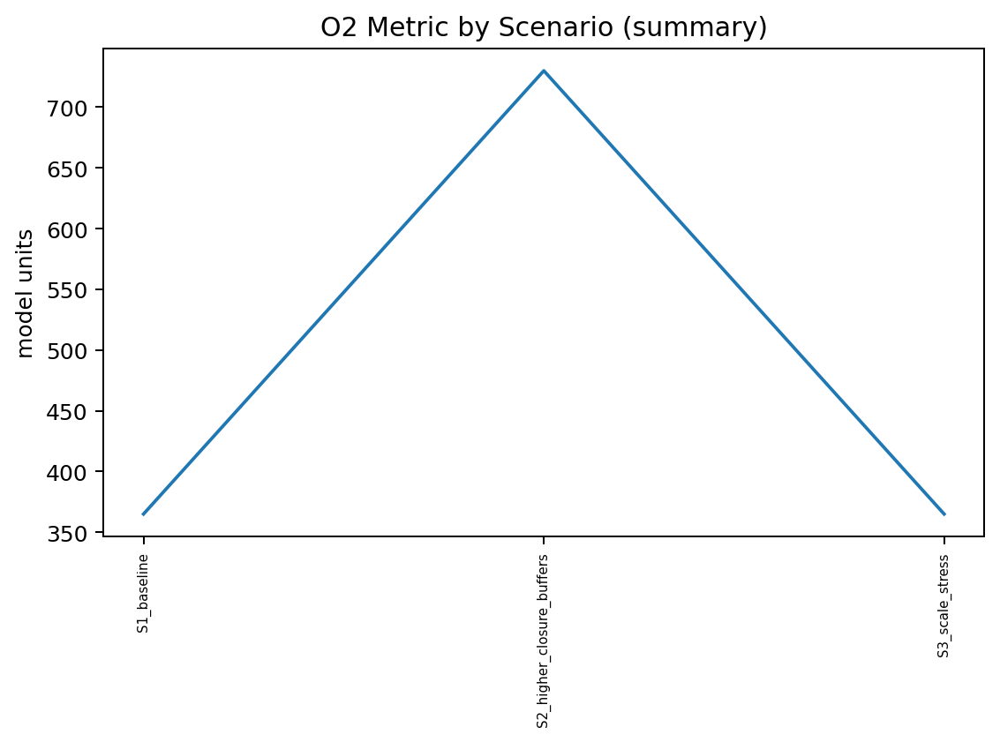
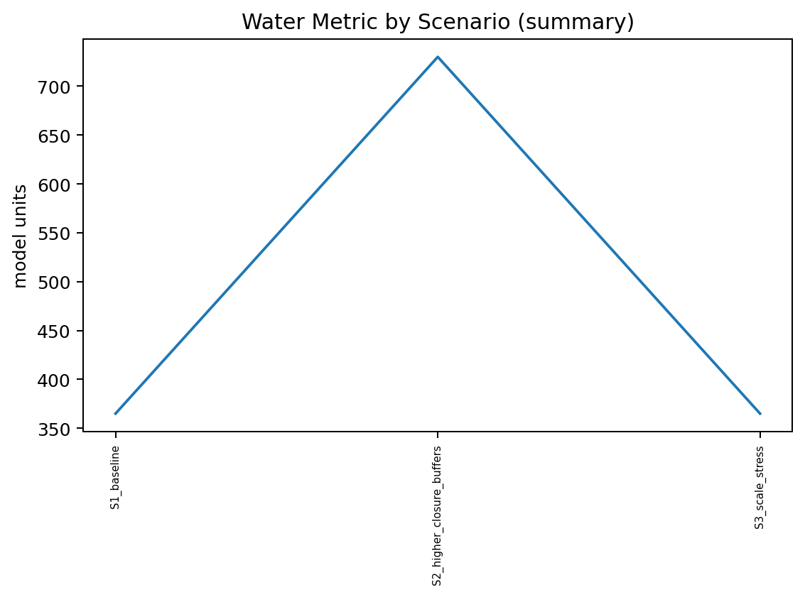



# Mars Colony Viability (Strict Science-Only Baseline)

This repository starts from **zero assumptions** and enforces a hard rule:

> **No numeric parameter is used unless it is backed by a verifiable primary source** (NASA/ESA technical reports, peer-reviewed journals, or NASA NTRS).

All verified numeric anchors are stored in `models/verified_constants.py` and documented in `VERIFIED_SOURCES.md`.

## What this repo answers (v0.0.x baseline)
A narrow, falsifiable engineering question:

**Given colony size `N0`, initial stores of O2 and water, local closure fractions, and discrete resupply windows: _when does the colony collapse due to O2 or water depletion?_**

Radiation is tracked only as **dose bookkeeping** using published cruise vs surface dose-equivalent rates.
This repo does **not** convert dose to clinical outcomes.

## Negative-result posture (important)
This project is designed to surface constraints. If a scenario collapses, that is a scientifically useful result (it reveals required closure/resupply conditions).

## What this repo explicitly does NOT do (yet)
- Food/calories model (requires verified agricultural yields and energy budgets).
- Fertility / multi-generational physiology at 0.38g (no verified human dataset).
- Long-duration ISRU reliability curves (requires demonstrated multi-year plant datasets).
- Terraforming claims.

See `docs/NON_CLAIMS.md`.

## Quickstart
### Install
`ash
python -m venv .venv
# Windows PowerShell:
. .\\.venv\\Scripts\\Activate.ps1
python -m pip install --upgrade pip
pip install -r requirements.txt
`ash
python main.py --help
Because parent directories may contain unrelated pytest configs, always run:
`ash
python -m pytest -c pytest.ini
- `docs/methodology.md` ? equations, units, collapse criterion (no speculative numbers)
- `docs/NON_CLAIMS.md` ? explicit scope limits and non-claims
- `paper/manuscript.md` ? manuscript scaffold (Markdown -> LaTeX/PDF later)

## Citation
See `CITATION.cff`.

- If/when a Zenodo DOI exists, it will be added to `CITATION.cff` and pinned in a new release.

## DOI
Zenodo DOI: 10.5281/zenodo.18517605

## Published Results (Reproducible)

The following scenarios were executed using the public codebase.
All results below are generated directly from model execution.

See:
- \
esults/published_metrics.csv\
- \
esults/published_metrics.md\

Key observable metric:
- \days_elapsed\: simulated survival time until system collapse.

<!-- PUBLISHED_RESULTS_START -->
## Published Results (Reproducible)

Source of truth: results/summary.csv (generated by running the public model).

Reproduce (PowerShell):
    python -m scripts.run_scenarios

Artifacts:
- results/summary.csv
- results/summary.md
- results/figures/*.png (if generated)

### Summary table (from results/summary.csv)
| scenario_id | N0 | o2_storage_days | water_storage_days | o2_local_fraction | water_local_fraction | water_recovery_fraction | launch_window_days | missed_window_probability | collapsed | collapse_day | dose_msv |
| --- | --- | --- | --- | --- | --- | --- | --- | --- | --- | --- | --- |
| S1_baseline | 12 | 365 | 365 | 0.97 | 0.98 | 0.98 | 780 | 0.2 | False | N/A | N/A |
| S2_higher_closure_buffers | 12 | 730 | 730 | 0.995 | 0.995 | 0.98 | 780 | 0.1 | False | N/A | N/A |
| S3_scale_stress | 50 | 365 | 365 | 0.98 | 0.985 | 0.98 | 780 | 0.2 | False | N/A | N/A |

### Figures
- 
- 

### Falsifiable outcome statements
- S1_baseline: N0=12, O2_local_fraction=0.97, Water_local_fraction=0.98, launch_window_days=780, missed_window_probability=0.2 -> collapsed=False at day=N/A; dose_msv=N/A
- S2_higher_closure_buffers: N0=12, O2_local_fraction=0.995, Water_local_fraction=0.995, launch_window_days=780, missed_window_probability=0.1 -> collapsed=False at day=N/A; dose_msv=N/A
- S3_scale_stress: N0=50, O2_local_fraction=0.98, Water_local_fraction=0.985, launch_window_days=780, missed_window_probability=0.2 -> collapsed=False at day=N/A; dose_msv=N/A

Notes:
- If collapse_day is N/A, the run ended without emitting a collapse day for that scenario (model output), not a manual edit.
<!-- PUBLISHED_RESULTS_END -->

## Cite this work

If you use this repository in research, please cite the Zenodo record.

- **Concept DOI (recommended):** https://doi.org/10.5281/zenodo.18481530  
  *(always resolves to the latest version)*
- **Version DOI:** https://doi.org/10.5281/zenodo.18481531  
  *(fixed snapshot for strict reproducibility)*

